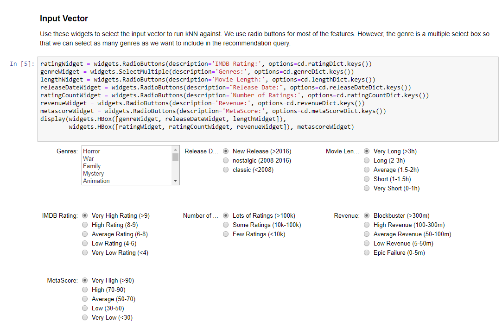

<h2>Assignment 2 - Content Recommender System</h2>

As requested this assignment was implemented as a jupyter notebook.

Since github doesn't allow jupyter notebooks to be displayed as a readme file yet please click on <a href="https://github.com/df424/drexel_INFO-T780/blob/master/content_recommender/Assignment2.ipynb">Assignment2.ipynb</a> to access the README for this folder.

Apperently the github jupyter renderer cannot display the widgets correctly.  Below is a screenshot of how the widgets look if you clone the repository and run the jupyter notebook live.

